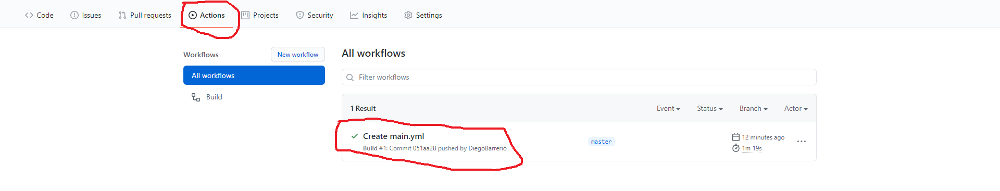
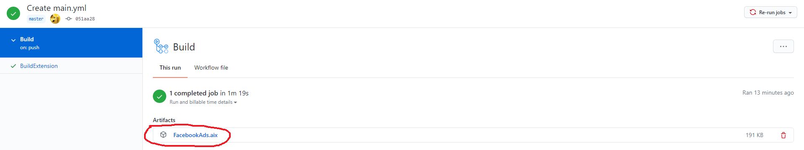

## Steps to generate extension

Open this link: https://github.com/new/import

Paste https://github.com/userid/FacebookAds/ In the textbox asking for url of old repo.

Choose everything and click on begin import button.

After the import is done open FacebookAds.java in your repository.

Change the first line from package com.ujvervueriuv.gbrvfgurweuvn; to package anytext;

Click on commit button and after few minutes you will get extension in actions tab of your repository(Last Commit).

